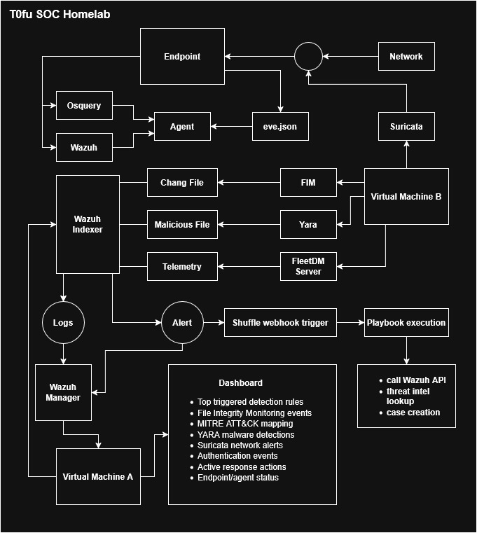

# Security Operations Center Home Lab ( [T0fu](https://github.com/T0fuHasuu) )

### Diagram



### Repository Structure Layout
```
t0fu-soc-homelab/
│
├── README.md
├── architecture/
│   └── network-diagram.png
├── setup/
│   └── installation-guide.md
├── detections/
│   └── custom-rules
├── attack-simulation/
│   └── kali-tests.md
├── reports/
│   └── incident-report-example.md
└── screenshots/
```

### VM-A

**Wazuh OVA**

Role:

* SIEM
* log storage
* alerting
* dashboard

Tools on VM-A:

* Wazuh Manager
* Wazuh Indexer
* Wazuh Dashboard

### VM-B

#### 1. Suricata

Installed directly on VM-B.

Purpose:
Network IDS sensor.

Data flow:

```
Network Traffic
      ↓
Suricata
      ↓
eve.json
      ↓
Wazuh Agent
      ↓
Wazuh SIEM (VM-A)
```

---

#### 2. YARA

Installed on VM-B.

Used with:

* Wazuh FIM
* Cortex analyzer (optional)

Purpose:
Malware file detection.

Data flow:

```
File Change
     ↓
Wazuh FIM alert
     ↓
YARA scan triggered
     ↓
Result sent to Wazuh
```

---

#### 3. FleetDM + osquery

Installed on **VM-B**.

Architecture:

```
VM-B
 ├─ FleetDM Server
 └─ osquery management
```

Agents installed on:

* laptop (Ubuntu)
* attack VM
* any test endpoint

Data flow:

```
Endpoint
(osquery agent)
      ↓
FleetDM Server (VM-B)
      ↓
Telemetry export
      ↓
Wazuh
```

Purpose:
Endpoint telemetry / EDR-style monitoring.

---

#### 4. Shuffle

Installed on **VM-B**.

Purpose:
SOAR automation.

Data flow:

```
Wazuh Alert
      ↓
Shuffle webhook trigger
      ↓
Playbook execution
      ↓
Actions:
• call Wazuh API
• threat intel lookup
• case creation
```

---

# Final Architecture

```
                VM-A
           ┌─────────────┐
           │   Wazuh     │
           │ SIEM Server │
           └──────▲──────┘
                  │
        logs / alerts
                  │
           ┌──────┴──────┐
           │    VM-B     │
           │  Debian 13  │
           │             │
           │ Suricata    │
           │ YARA        │
           │ FleetDM     │
           │ Shuffle     │
           └──────▲──────┘
                  │
           Endpoint Agents
        (osquery + wazuh agent)
```


### **four SOC pillars**

| Capability         | Tool     |
| ------------------ | -------- |
| SIEM               | Wazuh    |
| Network Detection  | Suricata |
| Endpoint Telemetry | osquery  |
| SOC Automation     | Shuffle  |
